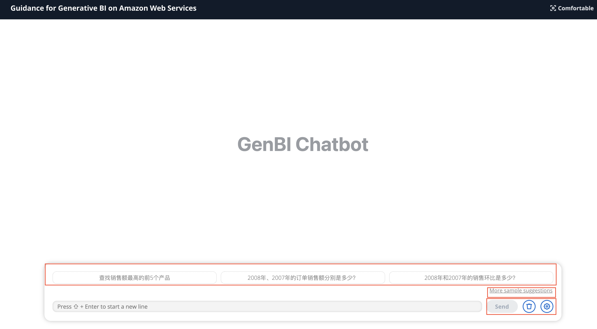
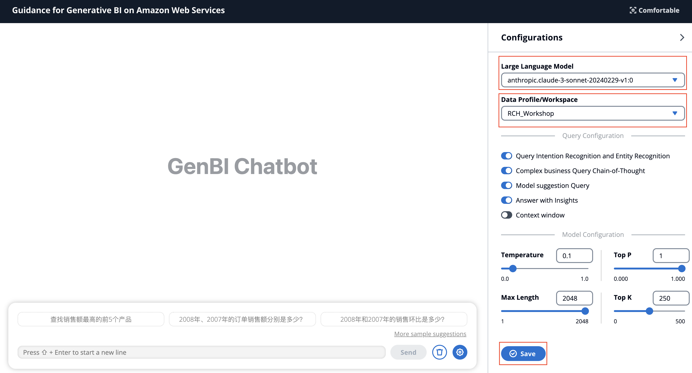
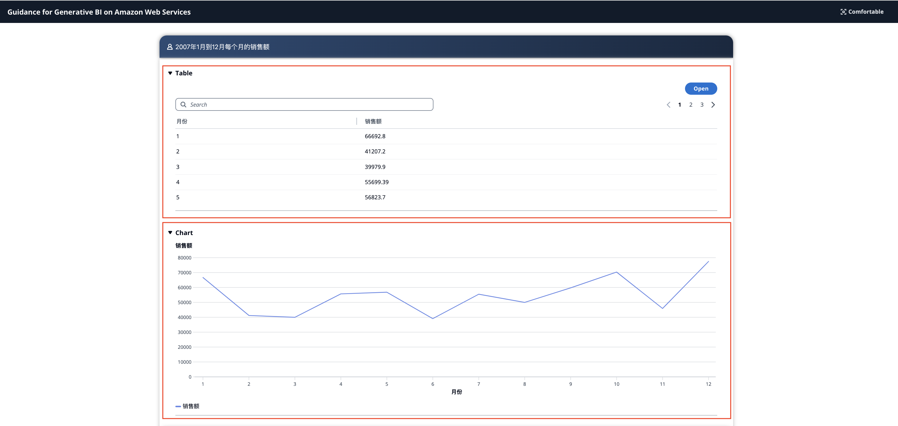
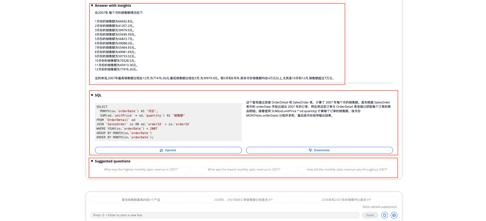

## 1. 用戶查詢介紹
以下我們介紹一下，使用者查詢介面的相關功能

    預製問題區域：對話框上面的區域
        More sample suggestions：點擊可以查看更多的預製問題
        設置預製問題，在GenBI管理員介面的Data Profile中
    Send：發送訊息
    删除：刪除目前的對話記錄
    設定：開啟設定頁面
    

點擊齒輪圖示可以開啟設定頁面

+ Large Language Model ： 選擇不同的大語言模型
+ Data Profile：選擇不同的Data Profile

針對query的設定有：

+ Query Intention Recognition and Entity Recognition：意圖辨識與實體辨識功能，開啟後可進行意圖識別
+ Complex business Query Chain-of-Thoug：問題分析功能，開啟之後可以對複雜的問題進行分析，把一個複雜的問題分解成多個複雜的子問題
+ Model suggestion Query：大模型建議問題，開啟之後，可以根據使用者的問題，產生建議問題
+ Answer with Insights：將查詢到的資料進行分析，開啟之後，把查詢到的資料給到大語言模型進行分析

目標模型的設定有：

+ Temperature：溫度係數，生成文字時隨機性的一個參數，0-1之間，0的時候隨機性最小，1的時候隨機性最大
+ Top P：文字生成時，按照一定的機率分佈選擇下一個單字
+ Max Length：輸出的最大長度
+ Top K：文字生成時，考慮模型預測的前k個最可能的單字

## 2. 數據查詢結果
+ Table：表格形式的數據
+ Chart：為了可以轉換成折線、圓餅圖、長條圖的數據，會在這個顯示相關的圖形，具體哪種形式由大模型決定

+ Answer with insight：針對數據解讀的大模型
+ SQL：左邊是原始的SQL，右邊是SQL的解釋
+ Upvote：正確輸入，點選之後資料進入到SQL知識庫中，可以在管理員頁面查看
+ Downvote：負回饋，點擊之後資料進入DynamoDB中
+ Suggested question：大模型生成的建議問題

